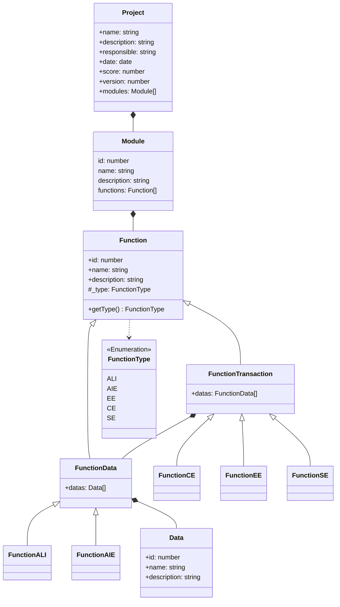

# APF Calc

 

Calculadora de esforço de projeto usando Pontos de Função.

## Diagrama de Classes

```mermaid
classDiagram
    Project *-- Module
    Module *-- Function
    Function <|-- FunctionData
    Function <|-- FunctionTransaction
    FunctionData <|-- FunctionALI
    FunctionData <|-- FunctionAIE
    FunctionTransaction <|-- FunctionCE
    FunctionTransaction <|-- FunctionEE
    FunctionTransaction <|-- FunctionSE
    Function ..> FunctionType
    FunctionData *-- Data
    FunctionTransaction *-- FunctionData

    class FunctionType {
        <<Enumeration>>
        ALI
        AIE
        EE
        CE
        SE
    }

    class Project {
        +name: string
        +description: string
        +responsible: string
        +date: date
        +score: number
        +version: number
        +modules: Module[]
    }    
    
    class Module {
        id: number
        name: string
        description: string
        functions: Function[]
    }
    
    class Function {
        +id: number
        +name: string
        +description: string 
        #_type: FunctionType
    }
    Function : +getType() FunctionType

    class FunctionData~Function~ {
        +datas: Data[]
    }

    class FunctionALI~FunctionData~ {
    }
    class FunctionAIE~FunctionData~{
    }

    class FunctionTransaction~Function~{
        +datas: FunctionData[]
    }

    class FunctionEE~FunctionTransaction~ {
    }
    class FunctionCE~FunctionTransaction~{
    }
    class FunctionSE~FunctionTransaction~ {
    }

    class Data {
        +id: number
        +name: string
        +description: string
    }
```