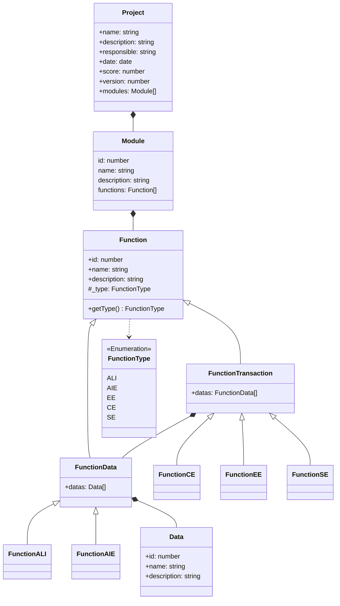

# APF Calc


 


Calculadora de esforço de projeto usando Análise de Pontos de Função, baseado nas informações do
[International Function Point Users Group](https://ifpug.org).

# Links Úteis

* [](https://github.com/LVRodrigues/apf-calc/wiki/Manual-do-Usu%C3%A1rio)

* [](https://ifpug.org/ifpug-standards/fpa)

## Publicar nova versão.

Usando o fluxo de trabalho [Git Flow](https://www.atlassian.com/git/tutorials/comparing-workflows/gitflow-workflow), execute os comandos:

```bash
git flow release start <id>
npm run release
git commit -a
git flow release finish '<id>'
```

## Diagrama de Classes

